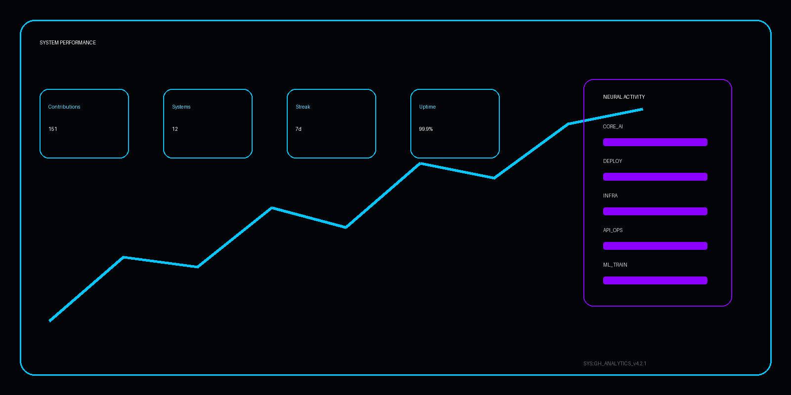

  

  

  <b>
    Building cinematic intelligent interfaces with VisionOS-inspired design language.
    Focused on AI orchestration and modern system architecture.
  </b>

 

  

 

<h3 align="center">🛰️ SYSTEM STACK</h3>

  

 

  

 

<h3 align="center">📊 SYSTEM DIAGNOSTICS</h3>

  

 

  

 

<h3 align="center">🚀 FEATURED SYSTEMS</h3>

<table>
<tr>

<td width="50%" align="center">

</td>

<td width="50%" align="center">

</td>

</tr>

<tr>

<td width="50%" align="center">

</td>

<td width="50%" align="center">

</td>

</tr>
</table>

 

  

 

<h3 align="center">🏆 ACHIEVEMENTS</h3>

  

 

  

 

<h3 align="center">📡 CORE CONNECTIVITY</h3>

  

 

  

