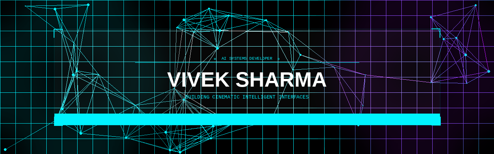
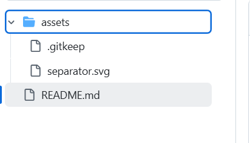

  

  

  <b>Building cinematic intelligent interfaces with VisionOS-inspired design language. Focused on AI orchestration and modern system architecture.</b>

 

  

 

### 
🛰️ SYSTEM STACK

  

 

  

 

### 
📊 SYSTEM DIAGNOSTICS

  
  

  

 

  

 

### 
🚀 FEATURED SYSTEMS

  <table border="0">
    <tr>
      <td width="50%" align="center">
        
      </td>
      <td width="50%" align="center">
        
      </td>
    </tr>
    <tr>
      <td width="50%" align="center">
        
      </td>
      <td width="50%" align="center">
        
      </td>
    </tr>
  </table>

 

  

 

### 
🏆 ACHIEVEMENTS

  

 

  

 

### 
📡 CORE CONNECTIVITY

  
  
  

  

 

  

